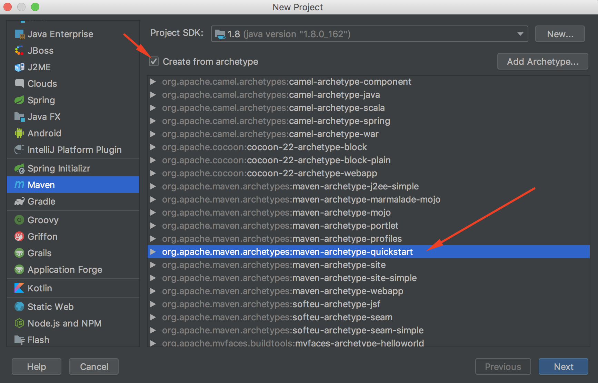
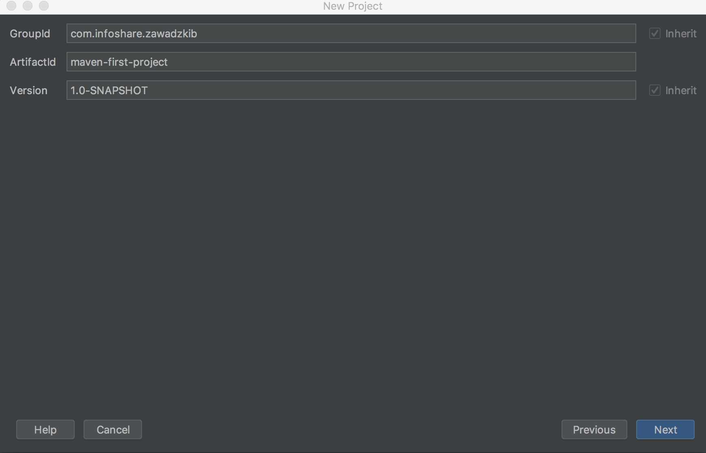

:toc: macro
:toc-title:
:toclevels: 99

# Maven

toc::[]

## Co to maven ?

* Zależności

* Zarządzanie

* Budowanie

* Testowanie

* 'Releasowanie'

### Alternatywy

ant, gradle, npm+webpack(JS), nuget+MSBuild(C#) + wiele innych

### Archetypy

https://maven.apache.org/guides/introduction/introduction-to-archetypes.html

### Zadanie 1

Stwórz nowy projekt mavenowy korzystajać z archetypu
`File -> New -> Project`
zaznacz 'Create from archetype' a następnie wybierz quickstart

uzupełnij informacje o projekcie:

* `GroupId: com.infoshare.<nazwisko>` służy do grupowania artefaktów, odwrócona domena ułatwia wyszukiwanie
* `ArtifactId: maven-first-project` nazwa artefaktu
* `Version: 1.0-SNAPSHOT` wersja artefaktu

-- Otwórz plik pom.xml i przeanalizuj jego zawartość.

<<<

-- Sprawdź co znajduje się w folderach src i test.

<<<

-- Uruchom klase App.java i AppTest.java.

<<<

-- W konsoli wpisz `mvn clean install` zobacz co zawiera folder `target`

<<<

-- W konsoli wpisz `mvn clean` odśwież zawartość folderu target

## Dependecies

image::https://www.monkeyuser.com/assets/images/2018/102-implementation.png[]

[source,xml]
.pom.xml
----
<dependencies>
    <dependency>
      <groupId>junit</groupId>
      <artifactId>junit</artifactId>
      <version>4.11</version>
      <scope>test</scope>
    </dependency>
  </dependencies>
----

* groupId - odwrócona domena to samo co podawaliśmy podczas tworzenia własnego projektu

* artifactId - też to samo, nazwa artefaktu, bibliteki, aplikacji

* version - wersja którą chcemy pobrać

* scope - w którym miejscu aplikacji zależność jest dostępna. W przypadku scope `test` zależność
jest dostępna tylko w folderze test aplikacji. Spróbuj dodać kod:

[source,java]
.test.java
----
 @Test
    public void test(){
        assertTrue( true );
    }
----

w klasie App.java i zobaczysz, że `@Test` oraz `assertTrue()` są nie do zaimportowania
a w klasie AppTest.java jest to możliwe.
Lista dostępnych scope-ów oraz dokumentacja do `dependecies`
jest dostępna tutaj: https://maven.apache.org/guides/introduction/introduction-to-dependency-mechanism.html[]

### Zadanie 2

Dodaj do maven-first-app nową zależność.
https://github.com/Devskiller/jfairy

Jest kilka repozytoriów z których można pobierać zależności.
Maven domyślnie korzysta z `Maven Central` https://mvnrepository.com/repos/central
można je łatwo przeszukiwać za pomocą https://search.maven.org/.

-- Wyszukaj bibliotekę jfairy by DevSkiller i dodaj ją do projektu korzystając
z `Dependecies` w `pom.xml`

-- Zobacz w README.md projektu jak stworzyć nowy obiekt `Person` a następnie zamiast
`Hello World!` wypisz w konsoli `Hello <person firstName> <person lastName>`
https://github.com/Devskiller/jfairy/blob/master/README.md

## Lifecycle

https://maven.apache.org/guides/introduction/introduction-to-the-lifecycle.html

* validate - validate the project is correct and all necessary information is available
* compile - compile the source code of the project
* test - test the compiled source code using a suitable unit testing framework. These tests should not require the code be packaged or deployed
* package - take the compiled code and package it in its distributable format, such as a JAR.
* verify - run any checks on results of integration tests to ensure quality criteria are met
* install - install the package into the local repository, for use as a dependency in other projects locally
* deploy - done in the build environment, copies the final package to the remote repository for sharing with other developers and projects.

### Zadanie 3

Zaimportuj projekt calculationlib.
Przeanalizuj `pom.xml` oraz `AppTest.java`.
W pliku `pom.xml` zmień ostatnią część groupId na swoje nazwisko.

-- Dodaj zależności do JUnita i AssertJ

-- Napisz 2 testy w 2 osobnych plikach sprawdzające wartość zamówienia dla typu NORMAL i BUSSINES,
możesz skopiować kod z klasy AppTest.java oraz dodać assercję sprawdzającą czy wartość zamównienia się zgadza.
Skorzystaj do napisania testu z wcześniej dodanych, JUnit i AssertJ.
https://junit.org/junit4/
http://joel-costigliola.github.io/assertj/

-- W konsoli uruchom testy za pomocą polecenia `mvn clean test` a następnie sprawdź co znajduje się
w folderze target/surefire-reports, czy jest plik jar w folderze target ?

-- W konsoli wpisz `mvn clean package`, sprawdź folder target.

### Plugins - surefire

https://maven.apache.org/surefire/maven-surefire-plugin/

[source,xml]
.surefire.xml
----
    <plugin>
        <groupId>org.apache.maven.plugins</groupId>
        <artifactId>maven-surefire-plugin</artifactId>
        <version>2.22.0</version>
    </plugin>
----

do pluginu można dodać konfigurację np. uruchomić tylko wybrane testy

[source,xml]
.surefire-includes.xml
----
    <plugin>
        <groupId>org.apache.maven.plugins</groupId>
        <artifactId>maven-surefire-plugin</artifactId>
        <version>2.22.0</version>
        <configuration>
            <includes>com.infoshare.bz.*Normal*</includes>
        </configuration>
    </plugin>
----

w tym przypadku zostaną uruchomione tylko te testy które znajdują się w pakiecie
com.infoshare.bz i mają w nazwie Normal.

Lista dostępnych opcji konfiguracji znajduje się tutaj
http://maven.apache.org/surefire/maven-surefire-plugin/test-mojo.html

#### Zadanie 4

Do calculationlib pom.xml dodaj surefire plugin
oraz dodaj konfigurację która uruchomi tylko jeden z dwóch napisanych testów.

Można do uruchomienia tylko jednego testu wykorzystać również parametr `-Dtest`

https://maven.apache.org/surefire/maven-surefire-plugin/examples/single-test.html

`mvn test -Dtest=CalculateBussinesTest`

### Properties

Maven wspiera dodawanie 'properties'

[source,xml]
.properties.xml
----
    <properties>
        <test.include>com.infoshare.bz.*Normal*</test.include>
        <junit.version>4.11</junit.version>
    </properties>
----

można ich później użyć w innych miejscach w pom.xml np.

[source,xml]
.usage-properties.xml
----
...
        <configuration>
            <includes>${test.include}</includes>
        </configuration>
        ...
        <version>${junit.version}</version>
----

#### Zadanie 5

-- Przenieś numery wersji zależności do properties oraz ścieżkę do testów
które mają się uruchamiać.

-- Dodaj nową properties o nazwie system.variable w którym wartością będzie `localhost`
następnie w surefire plugin można ustawić zmienne systemowe
wewnątrz konfiguracji

[source,xml]
.system variables.xml
----
    <systemPropertyVariables>
        <system.env>${system.variable}</system.env>
    </systemPropertyVariables>
----

a następnie w teście wypisz zmienną za pomocą:
`System.out.println("Env is: " + System.getProperty("system.env"));`

uruchom testy za pomocą `mvn test` i zobacz czy w logu pojawi się wiadomość z odpowiednią wartością.

### Profiles

Profile pozwalają określić z jakim profilem/zestawem zmiennych chcemy uruchomić aplikację

[source,xml]
.profiles.xml
----
    <profiles>
        <profile>
            <id>localhost</id>
            <properties>
                <system.variable>localhost</system.variable>
            </properties>
        </profile>
        <profile>
            ...
    </profiles>
----

w takim przypadku możemy uruchomić maven'a z profilem localhost

`mvn test -Plocalhost` -P<id_profilu>

#### Zadanie 6

Dodaj profile `localhost` i `qa-env` oraz nadpisz system.variable
dla localhost zostaw wartość localhost a dla qa-env ustaw wartość qa-env.
Następnie uruchom `mvn clean test -P<id_profilu>` dla localhost i qa-env

Properties można również tworzyć w taki sposób:
[source,xml]
.empty property.xml
----
    <properties>
        <system.variable/>
    </properties>
----
co oznacz, że ma ona wartość pustego string'a

do profilu można również dodać atrybut activeByDefault
[source,xml]
.activation profile.xml
----
        <profile>
            <id>localhost</id>
            <activation>
                <activeByDefault>true</activeByDefault>
            </activation>
----
co oznacza, że jeśli nie podamy żadnego profilu ten będzie uruchomiony domyślnie.

### Install

Uruchom polecenie `mvn clean install` a następnie przeanalizuj log oraz folder target.
Polecenie install buduje aplikacje, uruchamia na niej testy a następnie zbudowny artefakt instaluje w lokalnym repozytorium maven'a.
Lokalne repozytorium znajduje się w katalogu domowym użytkownika w folderze `.m2`
Za każdym razem gdy budujemy aplikację i ściągamy zależności są one tam zapisywane/ cache'owane i przy następnym buildzie jeśli
zależności/dependency istnieje w lokalnym repo nie jest pobierane.
Można wymusić pobranie używająć parametru -U od update
`mvn clean install -U`

#### Zadanie 7

Zainstaluj aplikacje w lokalnym repozytorium, sprawdź czy znajduje się tam ten same jar co w folderze target aplikacji

### Deploy

#### Nexus
Nexus to jedno z wielu narzędzi do stowrzenia swojego prywatnego 'maven central'
czyli miejsce gdzie można przechowywać artefakty.

Instalacja nexus'a:

    docker run -d -p 8081:8081 --name nexus sonatype/nexus:oss

Adres oraz dane logowania:

    localhost:8081/nexus
    username: admin, password: admin123

#### DistributionManagement

`mvn deploy` 'instaluje' aplikację na nexusie, czyli wrzuca stworzonego jara na nexusa.
Aby maven wiedział gdzie go wrzucić trzeba dodać w pom.xml

[source,xml]
.deploy.xml
----
        <distributionManagement>
            <snapshotRepository>
                <id>infoshare-devqa</id>
                <name>InfoShare Repository Snapshot</name>
                <url>http://localhost:8081/nexus/content/repositories/snapshots/</url>
            </snapshotRepository>
            <repository>
                <id>infoshare-devqa</id>
                <name>InfoShare Repository Release</name>
                <url>http://localhost:8081/nexus/content/repositories/releases/</url>
            </repository>
        </distributionManagement>
----

#### Settings.xml

W folderze .m2 trzeba dodać nowy plik `settings.xml`

[source,xml]
.settings.xml
----
<settings>
   <servers>
    <server>
        <id>infoshare-devqa</id>
        <username>admin</username>
        <password>admin123</password>
    </server>
  </servers>
</settings>
----

w którym zawarte są dane do zalogowania do nexus'a
tutaj można dwiedzieć się więcej o konfiguracji maven'a
https://maven.apache.org/settings.html

#### Zadanie 8

-- Dodaj konfigurację potrzebną do wrzucenia artefaktu na nexus'a

-- Zmień numer wersji aplikacji oraz upewnij się, że groupId zawiera twoje nazwisko

-- Uruchom `mvn deploy` a następnie sprawdź czy artefakt z odpowiednią wersją znajduje się na nexusie

-- Usuń `SNAPSHOT` z wersji i wtedy uruchom `mvn deploy` zobacz co się stanie ?

## Zadanie - calculationapp

-- Zaimportuj projekt calculationapp.

-- Dodaj zależność do calculationlib do swojej wersji biblioteki.
Aby to zrobić musisz wcześniej dodać w pom.xml
[source,xml]
.repository.xml
----
    <repositories>
        <repository>
            <id>infoshare-devqa-snapshot</id>
            <name>infoshare-devqa</name>
            <url>http://localhost:8081/nexus/content/repositories/snapshots/</url>
        </repository>
        <repository>
            <id>infoshare-devqa-release</id>
            <name>infoshare-devqa</name>
            <url>http://localhost:8081/nexus/content/repositories/releases/</url>
        </repository>
    </repositories>
----

Inaczej nawet po dodaniu <dependency> ... nie będzie ona widoczna do pobrania ponieważ nie znajduje się na maven central
tylko na naszym prywatnym repozytorium.

Odkomentuj kod w klasie App.java w calculationapp i uruchom aplikację, zobacz czy działa.

## Fat Jar

W calculationapp pom.xml dodaj plugin
[source,xml]
.maven-assembly.xml
----
    <properties>
        <fully.qualified.main.class>com.infoshare.bz.App</fully.qualified.main.class>
    </properties>

    <build>
        <plugins>
            <plugin>
                <groupId>org.apache.maven.plugins</groupId>
                <artifactId>maven-assembly-plugin</artifactId>
                <executions>
                    <execution>
                        <goals>
                            <goal>attached</goal>
                        </goals>
                        <phase>package</phase>
                        <configuration>
                            <descriptorRefs>
                                <descriptorRef>jar-with-dependencies</descriptorRef>
                            </descriptorRefs>
                            <archive>
                                <manifest>
                                    <mainClass>com.infoshare.bz.App</mainClass>
                                </manifest>
                            </archive>
                        </configuration>
                    </execution>
                </executions>
            </plugin>
        </plugins>
    </build>
----

następnie zbuduj aplikację tak aby artefakt znalazł się w folderze target
a potem uruchom go za pomocą polecenia

`java -jar target/calculation-app-1.0-SNAPSHOT-jar-with-dependencies.jar`

